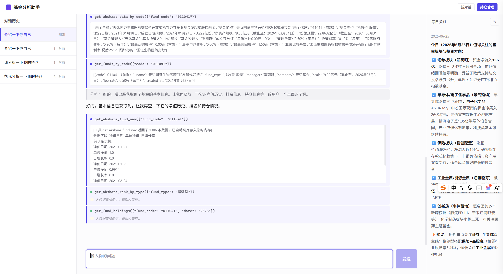

# 基金分析 Agent

面向普通基民的智能基金分析助手 — 用自然语言查询基金、分析持仓、获取市场动态。

LLM + Tool Calling + 向量数据库 + 结构化数据的 Agent 学习项目。



## 技术栈

| 层级        | 技术                                                            |
| --------- | ------------------------------------------------------------- |
| 框架        | FastAPI（异步 SSE 流式响应）                                          |
| LLM       | DeepSeek（deepseek-v4-flash），OpenAI 兼容接口                       |
| Web 搜索    | Tavily                                                        |
| 向量数据库     | ChromaDB（知识库 / 对话记忆 / 投资大师语料）                                |
| 关系数据库     | SQLite（基金持仓 / 净值 / 对话历史 / 工具数据临时存储）                            |
| 数据源       | akshare（天天基金 / 东方财富公开数据）                                      |
| 前端        | 原生 HTML + CSS + JS（无框架）                                       |
| Embedding | sentence-transformers (paraphrase-multilingual-MiniLM-L12-v2) |

## 架构

```
FastAPI 入口 (app.py) → 静态前端 /
  └── MainAgent (主调度 Agent, 继承 OrchestratorAgent)
        ├── LLM 推理（DeepSeek，Function Calling + 流式输出）
        ├── 普通 Tool（偏好记录 / 数据检索, 线程池并行执行）
        ├── delegate_search_subagent → SearchAgent
        │     ├── 互联网搜索 / 新闻 / 基金数据查询
        │     ├── akshare 多维度数据（净值 / 排行 / 持仓 / 行业 / 热度）
        │     └── Text2SQL（SQLite 临时查询 + 大数据切片存储）
        └── delegate_*_subagent → MasterAgent (投资大师)
              ├── Buffett_Warren — 巴菲特历年股东信语料
              ├── Duan_Yongping — 段永平投资言论与传记
              └── Bogle_John — 指数基金之父方法论
```

## 快速开始

### 环境要求

- Python 3.10+
- Windows / Linux / macOS

### 安装

```bash
git clone https://github.com/l1141275900/fund_agent.git
cd fund_agent

python -m venv .venv
# Windows: .venv\Scripts\activate
# Linux/Mac: source .venv/bin/activate

pip install fastapi uvicorn openai chromadb sentence-transformers tavily-python akshare httpx pydantic
```

### 配置 API Key

```bash
# Windows PowerShell
$env:DEEPSEEK_API_KEY = "your-key"
$env:TAVILY_API_KEY = "your-key"

# Linux/Mac
export DEEPSEEK_API_KEY="your-key"
export TAVILY_API_KEY="your-key"
```

### 启动

```bash
uvicorn app:app --reload --host 0.0.0.0 --port 8000
```

- 前端界面：`http://localhost:8000`
- Swagger 文档：`http://localhost:8000/docs`

## API

### 对话

| 方法     | 路径                           | 说明                          |
| ------ | ---------------------------- | --------------------------- |
| POST   | `/chat/query`                | 对话接口（SSE 流式，含思考过程 + 工具调用状态） |
| GET    | `/chat/sessions`             | 获取所有对话记录                    |
| GET    | `/chat/messages?session_id=` | 获取指定对话消息                    |
| DELETE | `/chat/session?session_id=`  | 删除对话                        |

### 基金数据 & 持仓

| 方法     | 路径                                     | 说明                                |
| ------ | -------------------------------------- | --------------------------------- |
| GET    | `/fund/query_fund?fund_code=`          | 查询基金详情                            |
| GET    | `/fund/get_fund_rank?fund_type=`       | 基金排行（全部/股票型/混合型/债券型/指数型/QDII/FOF） |
| GET    | `/fund/get_fund_nav?fund_code=`        | 基金净值历史                            |
| GET    | `/fund/get_fund_hold?fund_code=&date=` | 基金持仓股票                            |
| PUT    | `/fund/submit_fund`                    | 批量添加持仓                            |
| GET    | `/fund/holdings`                       | 查看全部持仓                            |
| DELETE | `/fund/remove_fund?fund_code=`         | 删除持仓                              |

## Agent Tool 列表

### MainAgent — 主调度

| Tool | 说明 |
| ---- | ---- |
| `agent_add_preference` | 记录用户偏好 |
| `delegate_search_subagent` | 委托搜索子 Agent |
| `delegate_Buffett_Warren_subagent` | 巴菲特投资大师 Agent |
| `delegate_Duan_Yongping_subagent` | 段永平投资大师 Agent |
| `delegate_Bogle_John_subagent` | 博格尔投资大师 Agent |

### SearchAgent — 搜索与数据

| Tool | 说明 |
| ---- | ---- |
| `search` | Tavily 互联网搜索 |
| `get_time` | 获取当前时间 |
| `get_news` | 20+ 平台热点新闻 |
| `get_akshare_fund_nav` | 基金净值历史 |
| `get_akshare_rank_by_type` | 按类型基金排行 |
| `get_akshare_data_by_code` | 基金基础信息 |
| `get_fund_holdings` | 基金持仓股票 |
| `get_akshare_stock_fund_flow` | 行业资金流向 |
| `get_akshare_hot_rank` | 市场热度排行 |
| `get_akshare_sw_index_third_info` | 申万三级行业估值 |
| `retrieve_tool_data` | 检索已切片的大数据 |
| `sql_get_tables` | Text2SQL 获取表列表 |
| `sql_get_schema` | Text2SQL 获取表结构 |
| `sql_execute_query` | Text2SQL 执行查询 |

### MasterAgent — 投资大师

每位大师拥有独立的 ChromaDB 知识库，可检索其投资方法论语料提供专业回答。

| 大师 | 语料来源 |
| ---- | -------- |
| Buffett_Warren | 1977-2024 年巴菲特致股东信 (50+ 篇) |
| Duan_Yongping | 段永平传记、演讲合集、访谈对话 |
| Bogle_John | 指数基金投资原则著作 |

## 项目状态

🚧 **开发中**

- [x] Agent 核心框架（16 个 Tool + 流式输出 + 大数据自动切片）
- [x] 多 Agent 协作架构（MainAgent → SearchAgent / MasterAgent 并行委托 + 流式汇聚）
- [x] 投资大师知识库（巴菲特 / 段永平 / 博格尔 ChromaDB 语料检索）
- [x] 前端 UI（对话 / 持仓管理 / 每日关注）
- [x] SQLite 对话历史持久化
- [x] ChromaDB 三层记忆（知识库 + 对话 + 工具数据临时存储）
- [x] akshare 多维度数据（基金详情 / 净值 / 排行 / 持仓 / 行业流向 / 热度）
- [x] 持仓管理（添加 / 查询 / 删除）
- [ ] 持仓诊断分析（组合健康度计算）
- [ ] 定时任务（每日资讯 / 净值更新）
- [ ] 每日关注自动推送

## 目录结构

```
agent_learn1/
├── app.py                  # FastAPI 入口 + lifespan
├── agents/                 # 多 Agent 系统
│   ├── main_agent.py       # 主调度 Agent
│   ├── search_agent.py     # 搜索与数据子 Agent
│   ├── master_agent.py     # 投资大师子 Agent
│   ├── tools.py            # Tool 数据类
│   └── agent_classes/      # Agent 基类
│       ├── base_agent.py   # BaseAgent（LLM 推理循环）
│       └── orchestrator_agent.py  # Orchestrator（并行委托 + 流式汇聚）
├── master_knowledge_base/  # 投资大师知识库（ChromaDB）
├── memory.py               # ChromaDB 用户记忆系统
├── tool_memory.py          # 大体积工具数据 SQLite 存储
├── env.py                  # 环境配置
├── static/                 # 前端 UI
├── routers/                # API 路由
├── schema/                 # Pydantic 数据模型
├── knowledge/              # 研报知识库（ChromaDB）
├── sqlite_db/              # SQLite 数据层（持仓 + 对话历史）
├── akshare_func/           # akshare 数据采集封装
├── tests/                  # 测试
└── 资源搜索/               # 数据爬虫子项目 + 投资大师语料
```

## License

MIT
